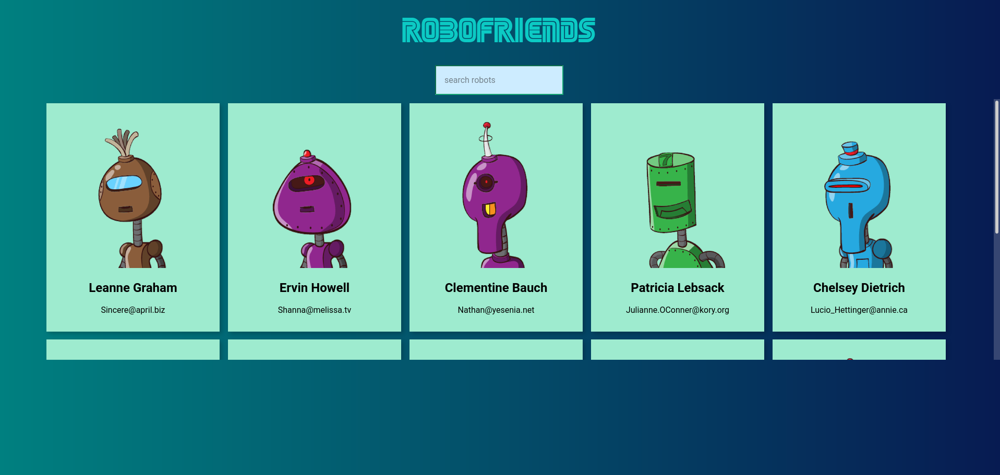

# Movie Search

Simple Robot Search app.

## Demo

[Movie Search App](https://aashish-khatri.github.io/robofriends/)

## Tools

Key tools used in this React project are:

|                        Tool                         | Description                                                                                          |
| :-------------------------------------------------: | ---------------------------------------------------------------------------------------------------- |
| [React](http://facebook.github.io/react/index.html) | A JavaScript library for building user interfaces                                                    |
|          [Tachyons](https://tachyons.io/)           | Create fast loading, highly readable, and 100% responsive interfaces with as little css as possible. |

## Installation

[node.js](http://nodejs.org/download/) is required to get `npm`.

If you would like to download the code and try it for yourself:

1. Clone the repo: `https://github.com/aashish-khatri/movie-search.git`
2. `cd robofriends`
3. Install packages: `npm install`
4. Build project and launch: `npm start`
5. Open your browser at: `http://localhost:3000/movie-search`
